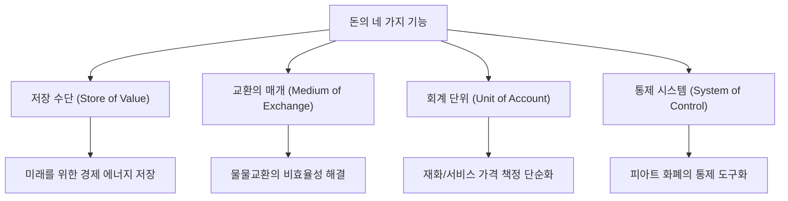
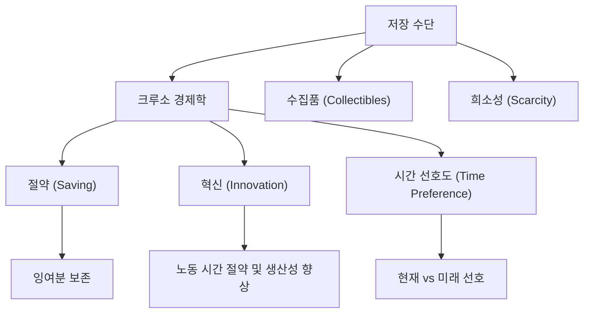
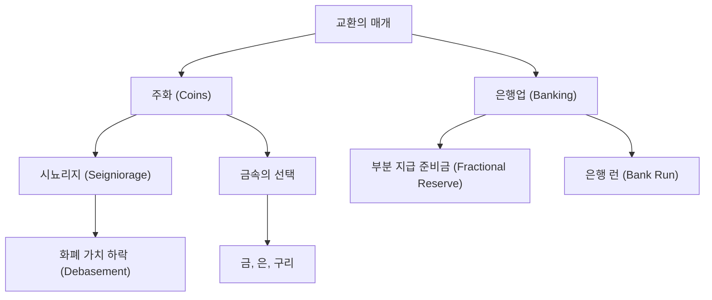
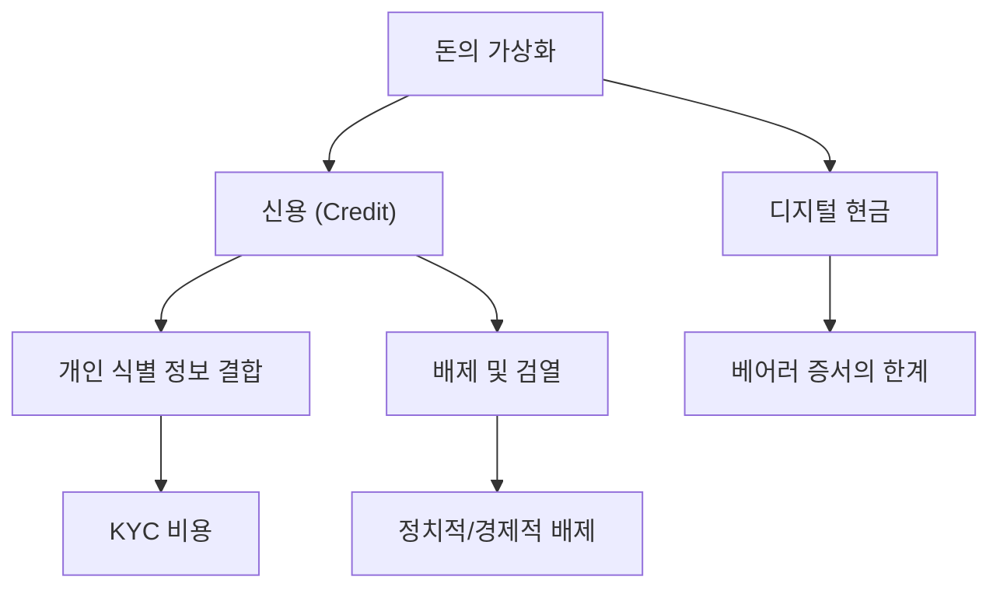

# Why Bitcoin — 강의 종합 정리

> 📚 출처: Exam1-1 강의 노트 (돈의 역사적 진화 ~ 비트코인의 탄생)

---

## 목차

- [핵심 질문](#핵심-질문)
- [1. 돈의 네 가지 기능](#1-돈의-네-가지-기능)
- [2. 저장 수단](#2-저장-수단-store-of-value)
- [3. 희소성의 경제학: S2F와 오스트리아 학파](#3-희소성의-경제학-스톡-투-플로우와-오스트리아-학파)
- [4. 칸티용 효과](#4-칸티용-효과-cantillon-effect)
- [5. 교환의 매개: 주화와 은행업](#5-교환의-매개-medium-of-exchange-주화와-은행업)
- [6. 인플레이션과 문명 붕괴](#6-인플레이션과-문명-붕괴)
- [7. 화폐 수렴과 은행업의 발전](#7-화폐-수렴과-은행업의-발전)
- [8. 통제 시스템으로서의 돈](#8-통제-시스템으로서의-돈-신용과-디지털화)
- [9. 돈의 진화 요약과 비트코인](#9-돈의-진화-요약과-비트코인)
- [전체 흐름 요약](#전체-흐름-요약)

---

## 핵심 질문

> 조개껍데기에서 신용 카드까지 수천 년에 걸쳐 진화한 화폐 시스템은 왜 반복적으로 중앙 권력에 의해 타락했는가?  
> 그리고 비트코인은 이 구조적 문제를 어떻게 해결하려는 시도인가?

---

## 1. 돈의 네 가지 기능



돈은 역사적으로 세 가지 전통적 기능을 수행했으며, 현대에는 네 번째 기능인 통제 시스템이 추가되었다.

| 기능 | 설명 |
|------|------|
| **저장 수단 (Store of Value)** | 미래를 위해 경제적 에너지를 저장하는 수단 |
| **교환의 매개 (Medium of Exchange)** | 내가 가진 것을 주고 원하는 것을 얻는 복잡한 교환 문제 해결 |
| **회계 단위 (Unit of Account)** | 모든 재화와 서비스를 단일 기준으로 가격 표시 |
| **통제 시스템 (System of Control)** | 현대 피아트 화폐의 사회 통제 도구화 (안드레아스 안토노풀로스 제안) |

기능의 역사적 발전 순서: **저장 수단 → 교환의 매개 → 회계 단위 → 통제 시스템**

---

## 2. 저장 수단 (Store of Value)



### 2.1. 크루소 경제학 - 절약과 혁신의 원리

로빈슨 크루소의 고립된 섬을 단순 경제 모델로 사용하여 경제학의 기본 원리를 이해한다.

- **즉각적 소비**: 매일 잡은 물고기 10마리를 전부 소비하면 잉여분이 없어 위기 상황에 취약하다.
- **절약 도입**: 건조·소금 첨가 등 저장 기술로 잉여분을 보존하면 생존 안정성이 높아진다.
- **혁신으로 연결**: 절약된 잉여분을 비상 상황 대비가 아닌 낚싯대·배 제작 등 혁신에 투자할 수 있다. 혁신은 절약 없이는 불가능하다.

경제학적 개념:
- **한계 효용 체감**: 물고기 1마리의 가치는 배고플 때와 배부를 때가 다르다.
- **긍정적 합산 게임**: 절약을 통해 낭비를 제거하고 더 많은 가치를 추출한다.
- **에너지 수확**: 인간의 화학 에너지에서 시작하여 도구·증기기관·핵분열 등 더 효율적인 에너지원으로 발전한다.

### 2.2. 시간 선호도 (Time Preference)

시간 선호도란 현재의 자신과 미래의 자신 중 어느 쪽에 더 큰 가치를 두는지를 나타내는 개념이다.

- **높은 시간 선호도**: 현재를 미래보다 우선시 (베짱이 타입)
- **낮은 시간 선호도**: 미래를 위해 현재를 희생하고 저축 (개미 타입)

> 모든 합리적인 인간은 동일한 조건에서 나중보다 지금 받기를 선호한다. 따라서 시간 선호도는 절대 0이 될 수 없으며, 모든 사람은 크고 작음의 차이만 있을 뿐 항상 양수(Positive)의 시간 선호도를 가진다.

핵심: 시간 선호도는 "미래를 선호하느냐"가 아니라, 미래를 위해 현재의 만족을 **얼마나** 희생할 의향이 있느냐의 정도 차이다.

### 2.3. 공유, 분업, 수집품으로의 진화

**공유 (Sharing)**: 개인 생산량에 관계없이 잉여분을 나누는 행위. 가족 단위에서 흔하다.

**분업 (Specialization)**: 각자 잘하는 일에 집중하여 전체 생산성을 높이는 긍정적 합산 게임. 인구 증가와 기술·야망·위험 회피 성향 등 다양성에 따라 성장한다.

**수집품 (Collectibles)의 특징**:

| 특징 | 설명 |
|------|------|
| 소모되지 않음 | 사용해도 사라지지 않음 |
| 내구성 | 오래 보관해도 특성 유지 |
| 희소성 | 수요 대비 공급이 적어 가치 발생 |
| 프라이버시 | 숨기기 쉬워 강탈로부터 보호 용이 |

**수집품의 화폐로서의 한계**:
수집품은 개체마다 예술적 가치·크기·모양이 달라 **대체 불가능(Non-fungible)**하고 분할이 어렵다. 즉, "이 조개껍데기와 저 조개껍데기를 1:1로 바꾸자"가 성립하지 않는다. 이 한계를 극복하기 위해 표준화된 무게·순도를 가진 **주화(Coins)**가 등장한다.

**경제 게임의 종류**:
- **긍정적 합산 게임 (교환, 계약)**: 자발적 교환은 당사자 모두에게 이익
- **제로섬/마이너스섬 게임 (강탈, 절도)**: 폭력·사기는 자원 낭비와 군비 경쟁 유발

> 살인·도둑질·납치를 금하는 윤리 규칙들은 단순한 도덕심이 아니라, 경제적으로 극히 비효율적인 행동(Negative Sum Game)을 막기 위해 생겨난 필연적인 규칙이다. 도둑질이 일반화되면 서로 갑옷과 무기를 만드는 데 자원을 낭비하는 군비 경쟁으로 이어진다.

---

## 3. 희소성의 경제학: 스톡-투-플로우와 오스트리아 학파

### 3.1. 스톡-투-플로우 (Stock-to-Flow, S2F)

생존에 필수적인 물보다 다이아몬드가 비싼 이유는 희소성 때문이다. 그런데 희소성은 단순히 "개수가 적다"는 것이 아니다.

> **예시**: 지구의 바다는 7개, 다이아몬드는 수백만 개지만, 다이아몬드가 더 희소하다. 단위를 어떻게 정하느냐에 따라 개수는 얼마든지 달라지므로, 개수 자체는 진정한 희소성의 척도가 될 수 없다.

**진정한 희소성 = S2F (공급의 비탄력성)**

```
S2F = 현재 유통 총량(Stock) ÷ 연간 생산량(Flow)
```

희소성이란 '현재 몇 개가 있느냐'가 아니라, **수요가 증가했을 때 공급을 얼마나 쉽게 늘릴 수 있느냐**에 달려있다.

- **화장지**: 수요 증가 시 생산 증가 용이 → 희소성 낮음
- **금**: 수요가 늘어도 채굴량이 선형적으로 늘지 않음 → 희소성 높음

### 3.2. 오스트리아 학파 경제학

비트코인의 철학적 배경이 되는 경제학파. 망가너, 폰 미제스, 하이에크 등이 주요 인물이며, 오스트리아-헝가리 제국에서 활동했기 때문에 이 이름이 붙었다 (초기에는 모욕적 의미로 사용되었다).

주류 경제학과 달리 **건전한 화폐(Sound Money)**, **시간 선호**, **희소성**에 중점을 둔다.

| 핵심 개념 | 내용 |
|-----------|------|
| 희소성과 S2F | 금은 S2F가 높아 희소성이 유지됨. 이것이 건전한 화폐의 조건 |
| 시간 선호와 자본주의 | 자본주의는 '소비'가 아니라 '저축과 투자'. 낮은 시간 선호 → 혁신·문명 발전 / 높은 시간 선호(인플레 심화 시) → 문명 쇠퇴 |
| 화폐의 비중립성 (칸티용 효과) | 돈을 찍어내는 곳에 가까운 사람이 먼저 이득, 서민은 물가 상승만 떠안음 |

> 오스트리아 학파는 정부의 개입(화폐 발행)을 반대하고, 시장의 자생적 질서와 개인의 행동(Human Action)을 중시하며, '절대적인 희소성'을 가진 건전한 화폐만이 문명을 발전시킬 수 있다고 본다.

### 3.3. 역사적 화폐 사례

- **소금 (Salt)**: 로마 군인 봉급(Salary)의 어원. 합리적인 S2F를 가졌다.
- **양 (Sheep)**: 화폐(Pecuniary)의 어원이 되었다.

---

## 4. 칸티용 효과 (Cantillon Effect)

> 새로운 돈이 경제에 풀릴 때, 누가 그 돈을 먼저 받느냐에 따라 부의 재분배가 일어나는 현상. 돈을 늦게 받는 사람(서민)의 구매력을 훔쳐서 먼저 받는 사람에게 이전한다.

### 4.1. 발생 원리

희소한 수집품이 돈으로 사용될 때, 생산 기술의 혁신으로 희소성이 변하면 발생한다.

**예시 1 - 조개껍데기**: 조개껍데기가 화폐인 섬에 원거리 채취 기술이 등장하면, 기술을 가진 생산자는 부유해지고 나머지 사람들은 부를 빼앗긴다.

**예시 2 - 베네치아 색유리 (화폐 식민주의의 실제 사례)**: 베네치아 상인들이 아프리카에 도착했을 때, 그들에게 색유리 구슬은 매우 저렴하게 대량 생산할 수 있는 것이었다. 현지인들에게는 희소하고 가치 있는 화폐였던 구슬을 베네치아인들이 무한정 공급하면서 현지 경제의 부를 사실상 흡수했다. 이것이 **화폐 식민주의**: 새로운 화폐를 대량 생산할 수 있는 주체가 기존 경제의 부를 흡수하는 현상.

### 4.2. 현대적 사례: 달러

중앙은행이 달러를 찍어내면 다음과 같은 시간차 구조로 부가 이동한다:

1. **핵심부**: 정부/공공 프로젝트 수혜자가 아직 물가가 낮을 때 많은 돈을 받음 → 실질 구매력 급증
2. **주변부**: 그 돈이 퍼지면서 인근 임금·물가가 먼저 오름
3. **파도**: 전국적으로 물가 상승
4. **서민**: 물가가 다 오른 뒤에야 임금이 오름 → 항상 뒤처짐
5. **반복**: 임금이 오를 때쯤 핵심부는 이미 또 다음 라운드의 새 돈을 받고 있음

결과: 고정 소득 근로자는 물가 상승분을 따라잡을 수 없어 실질 구매력이 지속적으로 감소한다.

---

## 5. 교환의 매개 (Medium of Exchange): 주화와 은행업



### 5.1. 수집품 vs 교환의 매개

수집품(Collectibles)은 교환이 가능했지만, 그 목적 자체가 교환은 아니었다 (목걸이는 목걸이이기도 했다). **교환의 매개**는 교환 자체를 목적으로 설계되거나 개선된 것이다.

부동산과의 차이: 부동산은 가치 저장 수단이지만 교환의 매개가 아니다. 집을 팔 때는 집→돈→재화/서비스 순서이며, 집 자체를 음식이나 서비스와 직접 교환하지 않는다.

### 5.2. 주화의 탄생

**유노 모네타 (Juno Moneta)**: 주노 신전에서 신도들이 봉헌한 금을 사제들이 녹여 비슷한 모양과 무게로 주조하면서 주화가 시작되었다.

**주화의 장점**:
- **분할 용이성**: 작은 단위로 나누기 쉬움
- **대체 가능성 (Fungibility)**: 예술적 가치보다 금속 순량이 기준이 되어 교환이 단순해짐
- **검증 용이성**: 무게 표시와 각인으로 신뢰 확보

### 5.3. 금, 은, 구리가 화폐로 선택된 이유

**화학적 이유**:
- 상온에서 고체 (수은처럼 액체가 아님)
- 가공 용이성 (말리어빌리티): 녹는점이 적당하고 부드러워 형태를 만들기 쉬움. 철이나 백금은 다루기 훨씬 어려움.
- 반응성: 금은 산화되지 않는 유일한 금속. 은·구리는 합금으로 내구성 보완.

**경제적 이유 (대체가능성)**:
- 균일하고 나눌 수 있고 합칠 수 있음 (금 1g은 언제나 금 1g → Fungible)
- 다이아몬드는 쪼개면 가치가 파괴되고 품질 편차가 커서 대체 불가 (Not Fungible)

> 자연계에 존재하는 원소들 중 녹슬지 않고, 나누기 쉽고, 들고 다니기 적당한 물질은 이 세 가지뿐이어서 전 세계 문명이 금·은·구리를 화폐로 선택했다.

**역할 분담**:

| 금속 | 역할 | 한계 |
|------|------|------|
| 금 | 휴대성 (S2F 최고, 고가치 밀도) | 소액 결제 불가 (쪼개면 가루) |
| 구리 | 분할성 (소액 결제 용이) | 대량 운반 불가 (배 수백 척 필요) |
| 은 | 중간적 성격으로 실생활에서 가장 널리 사용됨 | - |

### 5.4. 시뇨리지 (Seigniorage)

**단순 수수료(Coining Fee)와 시뇨리지의 차이**:
- **수수료(정상적 방식)**: 금 100g을 가져오면 수수료 1g을 떼고 1g짜리 동전 99개를 준다. 액면가와 실질 가치가 일치한다.
- **시뇨리지**: 금 100g을 가져오면, 0.9g만 넣고 1g이라고 쓴 동전을 만든다. 차액을 주조자가 착복한다.

시뇨리지는 단순한 수익이 아니라, **액면가(1g)와 실질 가치(0.9g)의 괴리에서 발생하는 부당 이득**이다. 동전을 의뢰한 사람뿐 아니라 그 동전을 받아쓰는 경제 전체에 대한 사기다.

**시뇨리지가 윤리적일 수 있는 조건**: 모든 시장 참여자가 동전에 금이 0.9g 들어있다는 사실을 알고 그에 맞춰 거래한다면 이론적으로는 윤리적이다.

**왜 현실에서는 사기인가**:
1. 0.9g짜리임을 알리고 싶다면 동전에 그렇게 적으면 된다. 굳이 1g이라고 적는 것은 아직 모르는 사람을 속이기 위함이다 (칸티용 효과를 노린 행동).
2. 국가는 법정 화폐법(Legal Tender)으로 "이 동전을 무조건 1g 가치로 받아라"를 강제하고, 독점(Monopoly)으로 정직한 경쟁 주조소를 제거한다.

**로마 데나리우스의 몰락**: 로마 황제들은 시뇨리지를 늘리기 위해 은 함량을 97%에서 1%까지 점진적으로 줄였다. 이는 로마 문명 붕괴의 한 원인으로 지목된다.

---

## 6. 인플레이션과 문명 붕괴

### 6.1. 인플레이션의 정의

**인플레이션 = 화폐 공급량 증가**

물가 상승은 인플레이션의 결과이지, 인플레이션 그 자체가 아니다. 기술 발전으로 가격이 하락하면 인플레이션이 상쇄될 수 있다. 즉, 물가 상승이 없다고 인플레이션이 없는 것은 아니다.

> **예시**: 스마트폰은 기술 발전으로 매년 가격이 낮아지는 경향이 있다. 만약 통화량을 늘렸는데도 스마트폰 가격이 그대로라면, 원래라면 더 내려갔어야 할 가격이 인플레이션 때문에 유지된 것이다. 물가가 오르지 않았더라도 인플레이션은 발생한 것이다.

### 6.2. 독점이 인플레이션의 필수 조건인 이유

원래 주조소는 경쟁 시장이었다. 어떤 주조소가 금 함량을 속이면, 사람들은 정직한 경쟁 주조소의 동전을 쓰면 그만이었다 → **경쟁이 사기의 브레이크 역할**.

국가 권력이 무력으로 경쟁자들을 제거(독점화)하자, 정부는 법정 화폐법(Legal Tender)의 보호 아래 마음 놓고 금 함량을 낮출 수 있게 되었다. 브레이크가 고장 난 폭주 기관차처럼 로마 제국의 초인플레이션을 가속화했다.

### 6.3. 인플레이션과 문명 붕괴의 연결 고리

```
화폐 타락(인플레이션)
    ↓
칸티용 효과: 보상 체계 붕괴
    ↓
열심히 일하는 사람(생산자)은 손해, 권력 근처에 있는 사람은 이득
    ↓
인재와 자원이 '생산(긍정적 합산 게임)'에서 '권력 획득 싸움(부정적 합산 게임)'으로 이동
    ↓
실질적인 재화·서비스 생산 감소, 과거 자본 소비(Capital Consumption)
    ↓
외부 충격이나 기근을 버티지 못하고 문명 붕괴
```

### 6.4. 인플레이션의 부수적 효과

**① 피스컬 드래그 (Fiscal Drag) - 세금의 함정**
- 인플레이션으로 명목 소득이 늘어나면 세금 구간(Tax Bracket)이 올라간다.
- 실질 구매력은 그대로거나 줄었는데 세금은 더 많이 내야 한다 → 소득이 국민에서 국가로 이동

**② 고정 소득 근로자 피해**
- 영업사원처럼 매일 가격 협상을 하는 사람은 인플레이션을 즉각 반영할 수 있다.
- 고정 임금 근로자는 계약 재협상에 시간이 걸려 항상 물가 상승보다 뒤처진다.

**③ 시간 선호도 증가**
- 저축의 가치가 떨어지면 사람들은 저축 대신 소비와 부채를 선택한다.
- 낮은 시간 선호도(저축→혁신)가 무너지고 베짱이 성향이 강해진다.
- 자본주의는 저축과 투자인데, 인플레이션이 심해지면 소비주의(자본주의의 반대)가 장려된다.

**④ 채권자 손해, 채무자 이득**
- 인플레이션으로 빚의 실질 가치가 하락한다.

### 6.5. 숨겨진 인플레이션

- **슈링크플레이션 (Shrinkflation)**: 가격은 그대로, 제품 크기나 양을 줄임
- **스킴플레이션 (Skimpflation)**: 가격은 그대로, 제품 품질이나 재료를 낮춤
- 이 방식들은 소비자가 인플레이션을 체감하기 어렵게 만든다.

### 6.6. 자산의 화폐화 (Monetization of Other Goods)

돈의 기능이 부패하면 사람들은 가치 저장을 위해 부동산·주식 등 다른 자산을 구매한다. 이 자산들의 가격은 기업·부동산의 실질 가치 향상이 아니라 인플레이션 압력으로 오르게 된다.

- 부동산이 화폐화되면 집값에 화폐 프리미엄이 포함되어, 원래라면 집을 살 수 있었던 사람들이 살 수 없게 된다.
- 로마 예술의 질적 저하 역시 시간 선호도 증가와 예술품의 비공식적 화폐화가 원인 중 하나로 지목된다. 예술적 수준의 저하는 문명 붕괴의 징조일 수 있다.

---

## 7. 화폐 수렴과 은행업의 발전

### 7.1. 단일 화폐로의 수렴

**메트칼프의 법칙 (물물교환의 복잡성)**
- 화폐 없이 물물교환할 때, 참여자 수가 늘수록 교환 비율의 수가 N²으로 폭발한다.
- 14명이 참여하면 교환 비율이 91가지가 된다. 식당 메뉴판이 백과사전만큼 두꺼워져야 한다.

**사르노프의 법칙 (단일 화폐의 효율성)**
- 모든 물건의 가치를 단 하나의 기준(화폐)으로 연결하면, 연결선이 참여자 수와 선형적(N)으로만 증가한다.
- 100가지 물건이 있어도 100가지 가격표만 있으면 된다.

경제 시스템은 N²의 복잡한 물물교환에서 선형적 단일 화폐 시스템으로 수렴하려는 본능이 있다.

### 7.2. 금속 화폐의 트레이드오프와 지폐의 등장

금, 은, 구리는 각각 휴대성과 분할성 사이에 트레이드오프가 존재한다. 결국 **금으로 수렴**하게 되고, 금의 휴대성 문제를 해결하기 위해 **금 보관 증서(지폐)**가 등장한다.

- **템플 기사단의 역할**: 금을 보관하고 증서를 발행하여 이동 편의성 제공
- **은행(Bank)**: 금을 보관하고 증서를 발행하는 기관
- **하이브리드 화폐**: 금속(주화)과 정보(지폐)가 결합된 형태

### 7.3. 부분 지급 준비금 (Fractional Reserve)

은행이 예금된 금의 일부만 보유하고 나머지를 대출·투자하는 방식.

- **비즈니스 모델**: 낮은 수수료로 경쟁 우위 확보, 또는 증서를 초과 발행하여 화폐 공급 증가
- **은행 런 (Bank Run)**: 사람들이 동시에 예금을 인출하려 할 때 발생. 은행이 파산할 수 있다.
- **칸티용 효과**: 부분 지급 준비금은 은행이 사실상 화폐 발행자 역할을 하게 만든다.
- **구제 금융**:
  - Bailout: 납세자 돈으로 파산 은행 구제
  - Bail-in: 고객 예금을 삭감하여 손실 분담
  - 둘 다 은행의 도덕적 해이(Moral Hazard)를 부추긴다.

### 7.4. 중앙은행의 등장과 피아트 화폐

| 단계 | 설명 |
|------|------|
| 자유 은행 시대 | 민간 은행들이 경쟁. 서로의 신뢰도 기반으로 운영 |
| 중앙은행 등장 | 은행 런 이후 정부가 중앙은행을 통해 화폐 발행 독점 |
| 브레튼우즈 체제 | 미국 연준(Fed)이 전 세계 달러의 금 교환 보증 |
| 1971년 닉슨 쇼크 | 달러에 대한 투기적 공격 → 달러의 금 태환 일시 중단 → 사실상 전 세계 부 몰수 |
| 피아트 화폐 | 법령(Decree)으로 공급 결정, 법정 화폐법으로 수요 강제 |

**페트로 달러**: 달러를 세금 납부, 채무 상환, 석유 거래에 사용하도록 강제하는 국제적 법정 화폐 시스템.

---

## 8. 통제 시스템으로서의 돈: 신용과 디지털화



### 8.1. 신용(Credit)의 등장과 문제

1971년 닉슨 쇼크와 동시에 컴퓨터·통신 기술이 폭발적으로 발전했다. 디지털 기술은 정보 복제를 매우 저렴하고 정확하게 만들었지만, 돈은 여전히 종이(지폐)에 묶여 있었다. 이 과정에서 신용(Credit) 형태의 화폐가 등장한다.

신용의 문제점:
- **검열 가능성**: 은행이나 카드사가 특정 수취인으로의 송금을 차단할 수 있다.
- **행동 연동**: 사회 신용 점수와 연동되어 특정 행동에 따라 사용이 제한될 수 있다 (예: 중국의 사회 신용 시스템).

### 8.2. 배제 (Exclusion)

**정치적 배제**: 정부나 기관이 특정 개인·단체의 자금 수령을 막을 수 있다 (예: 위키리크스, 캐나다 트럭 시위).

**경제적 배제 (KYC 비용)**: 디지털 장부에 참여하려면 신원 확인(KYC) 절차가 필요하다. 이 비용이 높아 금융 시스템에 편입되지 못한 사람들은 글로벌 전자상거래나 금융 활동에서 배제된다.

### 8.3. 프라이버시와 사이퍼펑크

**프라이버시의 중요성**: 가치를 저장할 때 프라이버시는 필수적이다. 완전한 정보 공개 환경에서는 물리적 힘이 지배하게 되어 부를 숨기는 능력이 중요해진다.

**사이퍼펑크 (Cypherpunks)**: 암호학(Cipher)을 사용하여 정부와 기업의 통제에 저항하는 해커·활동가 집단. 목표는 인터넷에서 디지털 현금을 구현하여 익명성과 검열 불가능성을 확보하는 것이다.

> **[보강 예정]** 사이퍼펑크 운동의 역사 및 비트코인 이전의 디지털 현금 시도들(DigiCash, b-money, HashCash 등)은 추후 보강 예정.

---

## 9. 돈의 진화 요약과 비트코인

### 9.1. 돈의 가상화 단계

| 단계 | 형태 | 특징 |
|------|------|------|
| 1단계 | 실물 객체 (조개껍데기) | 물리적, 정보 불필요 |
| 2단계 | 주화 | 물리적 내용물(금속) + 정보(무게) = 부분 가상화 |
| 3단계 | 지폐 | 종이 위의 정보, 금의 대표(Representative) 역할 |
| 4단계 | 신용/디지털 신용 | 물리적 지지체 없이 정보만, 개인 신원과 연결 = 완전 가상화 |

### 9.2. 비트코인: 두 전통의 융합

비트코인은 두 사상의 융합으로 탄생했다:

- **오스트리아 학파 경제학**: 절대적 희소성(S2F), 건전한 화폐, 인플레이션 비판
- **사이퍼펑크 운동**: 암호학적 프라이버시, 검열 저항, 탈중앙화

비트코인은 신용의 편리함(속도)을 유지하면서도, 조개껍데기처럼 **주권적이고 탈중앙화된** 형태의 화폐로 되돌아가려는 시도다.

---

## 전체 흐름 요약

```
[돈의 역사적 진화]
    │
    ├─ 저장 수단 → 수집품 (희소성·내구성·프라이버시)
    │               └─ 한계: 개체마다 달라 대체 불가능 → 주화로 발전
    │
    ├─ 교환의 매개 → 주화 (금·은·구리)
    │                ├─ 시뇨리지: 액면가 ≠ 실질 가치 → 칸티용 효과 발생
    │                ├─ 독점: 경쟁 제거 → 인플레이션 브레이크 고장
    │                └─ 지폐(금 보관 증서) → 부분 지급 준비금 → 은행 런 → 중앙은행
    │
    ├─ 회계 단위 → 단일 화폐 수렴 (물물교환 N² → 단일 화폐 N)
    │               └─ 금본위제 → 브레튼우즈 → 1971 닉슨 쇼크 → 피아트 화폐
    │
    └─ 통제 시스템 → 신용 화폐 (신원 연동·KYC·검열·정치적 배제)
                     └─ 사이퍼펑크 저항 운동

[비트코인의 등장]
    오스트리아 학파 (절대적 희소성·건전한 화폐·인플레이션 비판)
        +
    사이퍼펑크 (암호학·프라이버시·검열 저항·탈중앙화)
    ──────────────────────────────────────────────────
    → 절대적 S2F + 검열 저항 + 탈중앙화를 동시에 달성하려는 시도
```

> **핵심**: 비트코인은 새로운 개념의 발명이 아니라, 오스트리아 학파가 정의한 '건전한 화폐의 조건(희소성·비중립성 제거)'과 사이퍼펑크가 추구한 '디지털 현금의 조건(프라이버시·검열 불가)'을 처음으로 동시에 만족시킨 시스템이다.
